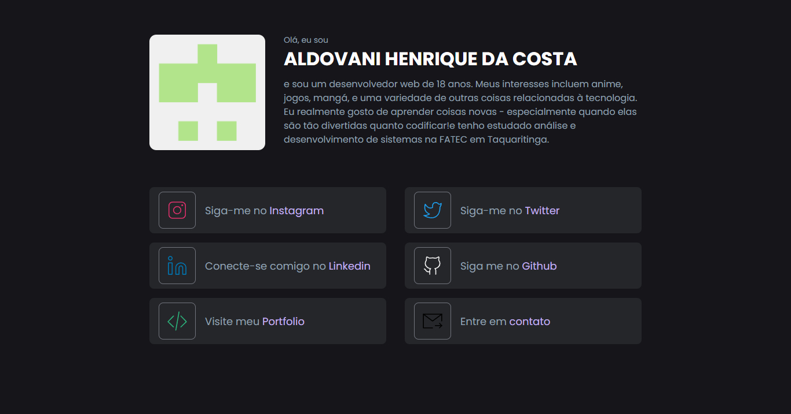

<h1 align="center">
  Bio - Aldovani Henrique
</h1>

<h4 align="center"><a href="https://aldovani-bio.vercel.app/">Clique para visitar o projeto</a></h4>

---

## 🛠 Tecnologias

- [React]()
- [Next](https://nextjs.org/)
- [CSS3](https://developer.mozilla.org/pt-BR/docs/Web/CSS)
- [Framer Motion](https://www.framer.com/motion/)
- [React Hook Form](https://react-hook-form.com/)
- [Google planilhas](https://console.cloud.google.com/)

---

<h2>🦄 Autor</h2>

<table>
  <tr>
    <td align="center">
      <a href="https://github.com/aldovani">
         
        
          <b>Aldovani</b>
        
      </a>
    </td>
  </tr>
</table>
